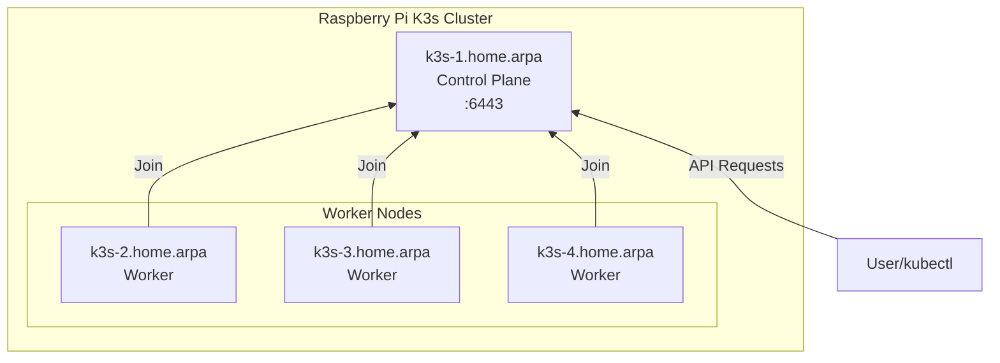

# Raspberry Pi K3s Cluster



## Prerequisites

Install Ansible (macOS):

```bash
brew install ansible
```

## Usage

Deploy K3s cluster:

```bash
ansible-playbook -i hosts site.yml --ask-vault-pass
```

Update all cluster nodes:

```bash
ansible-playbook -i hosts system-update.yml --ask-vault-pass
```

Edit the encrypted vault file:

```bash
ansible-vault edit group_vars/vault.yml
```
