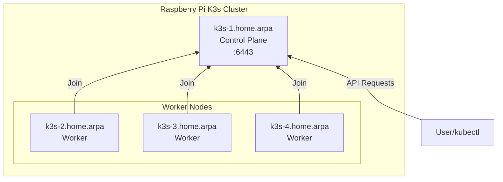

# Raspberry Pi K3s Cluster



## Prerequisites

Install Ansible and kubectl (macOS):

```bash
brew install ansible kubectl
```

Install required Ansible collections:

```bash
ansible-galaxy collection install kubernetes.core
```

## Setup

1. Generate a secure K3s token:

```bash
openssl rand -base64 32
```

2. Create encrypted vault file:

```bash
ansible-vault create group_vars/cluster/vault.yml
```

Add the token:

```yaml
---
k3s_token: "your-generated-token-here"
```

## Usage

### Deploy Cluster

Deploy K3s cluster and create service accounts:

```bash
ansible-playbook -i hosts site.yml --ask-vault-pass
```

After deployment, kubeconfig files are generated in `kubeconfigs/` (gitignored). Copy to your kubectl config:

```bash
mkdir -p ~/.kube
cp kubeconfigs/admin-kubeconfig.yaml ~/.kube/config
```

Test cluster access:

```bash
kubectl get nodes
```

### Update System Packages

Update all cluster nodes:

```bash
ansible-playbook -i hosts system-update.yml --ask-vault-pass
```

### Modify Configuration

Edit K3s configuration or service accounts in `group_vars/cluster/vars.yml`, or edit secrets:

```bash
ansible-vault edit group_vars/cluster/vault.yml
```

Re-run playbook to apply changes:

```bash
ansible-playbook -i hosts site.yml --ask-vault-pass
```
